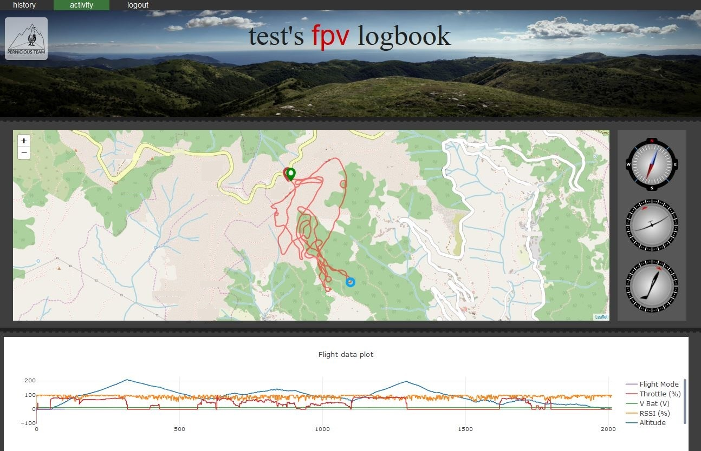

# FPV logbook
Every pilot needs a logbook for its flight, but writing down everything is boring and you couldn't write everything. 
This project is for people like me, that would like to have every single flight logged with every detail, but doesn't like to write it down when it's time!

## Getting Started

Since "FPV logbook" project is a web application, in order to make it work you will need an hosting machine with a webserver.
However, if you like to have a local and portable version of the logbook, you could use one of the portable webserver software available online.

### Prerequisites

- Web server (ex Apache)
- PHP5 
- MySQL
- PHPmyadmin (optional)
- blackbox-tools
- INAV or Betaflight log files with GPS coordinates

### Installing

I'm not going to explain how to setup a webserver from scratch.. you can find tons of tutorial online. 
When you have your web server online, just make few check before start:
- write an index.html within the "www" folder, with <?php phpinfo(); ?> inside. 
- check that the page is reachable and the php version is PHP5
- open PHPmyadmin and check that everything is ok and the database is working

Change the db root password as you prefer.
At this point you can copy the files and folders of the project within your "www" folder 
After done that you have to modify the "dbint.php" file and update the following fields:
define('DBHOST','localhost');
define('DBUSER','root');
define('DBPASS','xxxxxxxxx');
define('DBNAME','fpvlog');

The "FPV logbook" use the blackbox-tools software in order to convert the log files, for this reason you have to download and place it within the "www" folder.
The folder that contain the blackbox-tools has to be called "blackbox-tools"...
If your server is based on linux you should compile the software and place the executable file in the same folder.
Depending on your OS you also have to modify the file "uploadFiles.php" and comment/decomment the rows 37/38.

Now you have to create and populate the database. To do it you can use the script that i've prepared and saved as db.sql.
Just open PHPmyadmin , go to SQL tab and copy&paste the script. If everythings gone right you should have a new db calle "fpvlog".
Now you're ready to go!

## Logging for the first time

To register just go to the project URL, press "Sign Up" and fill all the fileds..
Since there isn't any email approval system for the new users, i gave the chance to create a new user but it won't be activated by default (you can change it if you like inside of "register.php" row 68).
To activate the user got to PHPmyAdmin "members" table and change "active=Yes"  on the newly created user.

Now you can go back to the login page and finally enter the website!

### What you can do with your logs

You have two main pages, "History" and "Activity"

In History you have a table with all your logs. You can order it as you want, delate and download your uploaded logs. To upload a new log you just have to drag&drop the file over the table.
The log files should contain the gps coordinate, unfortunately at the moment it doesn't works with logs without it. The log files should have ".txt" extension.
Under the table these is a map with the track of your flight ad at right there are few important data of the selected flight.
The map controls (pan and zoom) are disabled by default , in order to ease the navigation. To enable/disable the map controls just click on it.

If you want to go deep in the log, just select one and go to "Activity" page.
There you have a bigger map with the track of the flight. On the right there are 3 instruments for the compass, pitch and roll.
Under the map there is a plot of some important data like altitude, Vbat, RSSI, Throttle.
To explore your flight you can just move the mouse over the plot.
You can see the numerical data of every enabled variable on the plot, in the place where you're pointing. At the same time will appear a blue circle on the map, to indicate the position of the vehicle corresponding to
the data on the plot. You can also have an idea of the attitude of the vehicle looking the instruments on the right.

Under the plot there are some information related to the flight, basically the same data that you have in the "History". In order to save more info as possible, you can also add the wheather condition during the flight
, the wind speed and you can write down some notes, giving a personal description of the flight.

Under the flight data you have the flight controller setup variables (like pids, rates etc..) that can be usefull in case you need to compare the behaviour of the vehicle with different parameters.

## Built With

* [notepad++](https://notepad-plus-plus.org/) - The editor
* [PHP5](https://http://php.net/) - Server side code
* [javascript] - Client side code
* [Plotly](https://plot.ly/) - JavaScript library for plots
* [Leaflet](https://leafletjs.com/) - JavaScript library for interactive map
* [blackbox-tools](https://github.com/betaflight/blackbox-tools/tree/master/src) - flight controller's log decode tool

## Authors

* **pernicious-flier** - *Initial work* - [FPVlogbook](https://github.com/flavioansovini/FPVlogbook)

## License

This project is licensed under GPLv3 - see the [LICENSE.md](LICENSE.md) file for details
